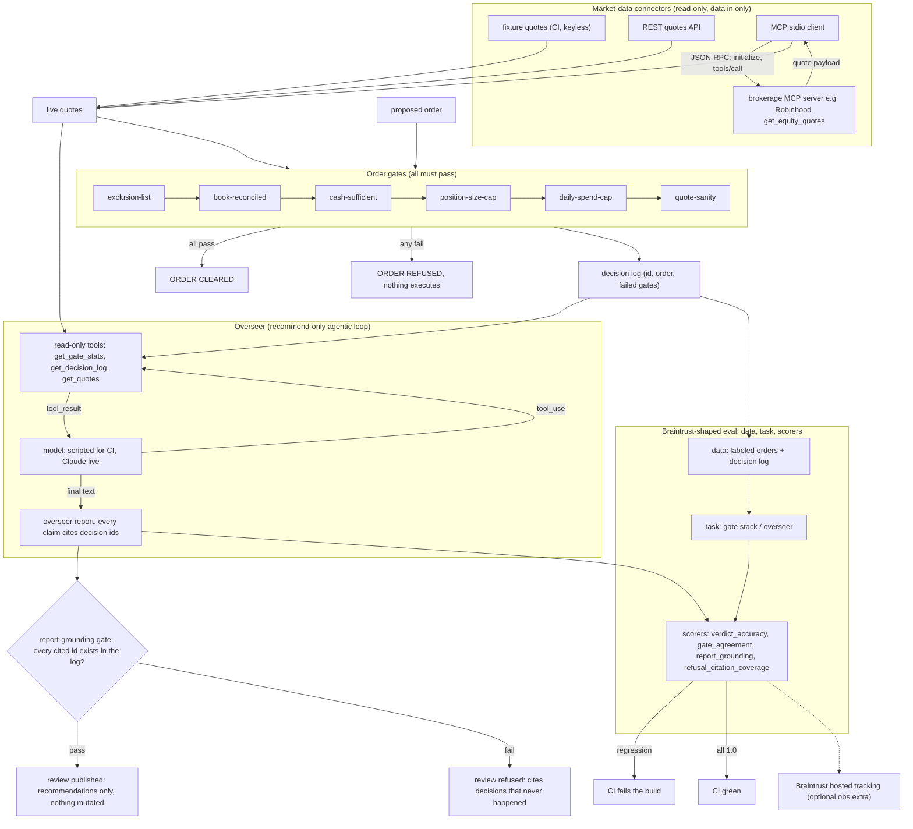

# trade-gate

[](https://github.com/jbisaccia-9/trade-gate/actions) · [captured results](RESULTS.md)

**Order-validation gates for an automated trader. Every trade must pass all of
them — and a stale book refuses everything.**

The premise, learned by running a real automated trading loop with real
discipline requirements: the dangerous moment isn't a bad signal, it's a bot
acting on a view of the world that's no longer true. So the load-bearing gate
here is **reconciliation** — if the local book doesn't match the broker's
snapshot position-for-position at the same sync sequence, no order executes,
no matter how good the trade looks. Everything in this repo is synthetic:
fictional tickers, invented balances, example caps.

Part of the *-gate* family:
[kappa-gate](https://github.com/jbisaccia-9/kappa-gate) ·
[roi-gate](https://github.com/jbisaccia-9/roi-gate) ·
[phi-gate](https://github.com/jbisaccia-9/phi-gate).
One thesis throughout: nothing ships until it passes a gate.

## The gates

| gate | refuses when |
|---|---|
| exclusion-list | the symbol is on the hard denylist — unconditional |
| **book-reconciled** | local positions ≠ broker snapshot, or sync sequences differ |
| cash-sufficient | order cost exceeds settled cash |
| position-size-cap | position would exceed a fixed fraction of portfolio value |
| daily-spend-cap | today's cumulative spend would exceed the cap |
| quote-sanity | the limit price drifts beyond ±5% of the live quote — or no quote exists |

All failures are reported, not just the first — a refused order should teach
something. CI runs the demo both ways: the clean order must clear, and the
excluded order must be refused (`! python -m tradegate check ...`) — the
unguarded path is a failing test.

```
$ python -m tradegate check orders/example_buy.json --broker data/broker_stale.json
order: buy 3 CCCC @ 42.5
  PASS  exclusion-list
  FAIL  book-reconciled: book at sequence 118 but broker snapshot is 121 - reconcile before trading
  PASS  cash-sufficient
  PASS  position-size-cap
  PASS  daily-spend-cap
ORDER: REFUSED - do not execute.
```

## Market-data connectors

The quote-sanity gate is fed by pluggable connectors — data flows **in**;
there is deliberately no order-placement connector anywhere in this repo:

| mode | source |
|---|---|
| `fixture` | committed synthetic quotes (CI, keyless clones) |
| `api` | any REST quotes endpoint (`QUOTES_API_URL` + `QUOTES_API_KEY`) |
| `mcp` | a minimal MCP stdio client (newline-delimited JSON-RPC, stdlib only) that spawns a configured server and calls its quote tool — point `connectors.json` at a brokerage MCP server (e.g. a Robinhood MCP server's `get_equity_quotes`) for live analytics |

CI exercises the MCP path end-to-end against a bundled toy server speaking
the same protocol, so the client code that talks to a real brokerage server
is the code the tests run.

## The overseer

Above the gates sits a monitoring agent — a **recommend-only overseer**
patterned on running a real overseer over a real trading loop: graders grade,
they do not steer. It reads the decision log and live quotes through tools
(`get_decision_log`, `get_gate_stats`, `get_quotes`) and writes a review —
refusal patterns, possible cap miscalibration, data-quality gaps — citing
decision ids for every claim.

Its authority is **structural, not rhetorical**: the overseer has no mutating
tools. It cannot edit config, clear a refusal, or place an order — the test
suite asserts the tool registry is read-only. And its report faces its own
gate: **grounding** — every cited decision id must exist in the log it
reviewed. CI runs a deliberately hallucinating backend that cites a decision
that never happened and asserts the gate refuses it
(`! python -m tradegate overseer hallucinating`). Live backend: Claude via the
`anthropic` SDK (`pip install ".[live]"`); scripted policy for keyless CI.

## Eval structure (Braintrust-shaped)

The whole stack is scored the way an eval platform scores it — `data → task →
scorers` — in the exact shape of Braintrust's `Eval(name, data, task, scores)`
contract, so the identical suite runs two ways: keyless and local in CI
(`python -m tradegate eval`, which fails the build on any regression), or
pushed to Braintrust for hosted tracking (`pip install ".[obs]"` +
`BRAINTRUST_API_KEY`).

| suite | task | scorers |
|---|---|---|
| gates | run the full gate stack on labeled orders | `verdict_accuracy`, `gate_agreement` (exact failed-gate set) |
| overseer | generate the review | `report_grounding`, `refusal_citation_coverage` |

The gates are deterministic — their eval exists to catch **regression**, which
is what an eval is for: change a threshold, reorder a gate, and the suite says
so before the change ships.

## The flow, end to end



Two loops, two gates on their outputs: the order loop ends at the gate stack,
the overseer loop ends at the grounding gate. The overseer has no edge back
into config or orders — that absence is the design.

## Quickstart

```
python -m venv .venv
.venv/bin/pip install -U pip
.venv/bin/pip install -e ".[dev]"
.venv/bin/python -m pytest -q
.venv/bin/python -m tradegate check orders/example_buy.json
QUOTES_MODE=mcp .venv/bin/python -m tradegate check orders/example_buy.json
.venv/bin/python -m tradegate overseer
```

Educational code about guardrail design. Not a trading system, not financial
advice; the fixtures are fiction.

MIT license.
